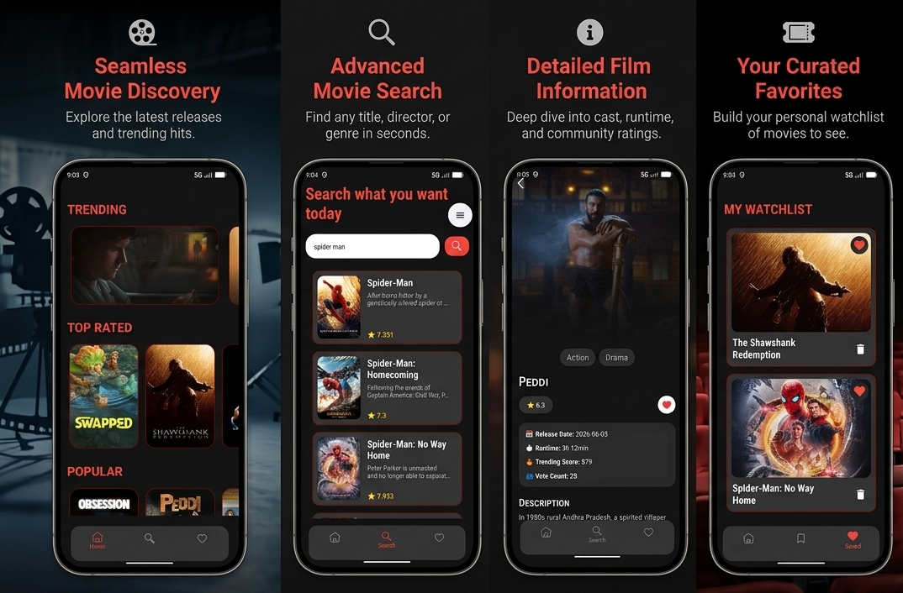

# 🎬 MovieBox

MovieBox is an Android app where you can browse movies, search for them, and save favorites. It uses TMDB API for all movie data.

---

## What you can do in the app

### Home screen

* see trending movies
* see top rated movies
* see popular movies
* scroll through lists horizontally

### Search

* search movies by name
* get results from API
* shows loading and error states

### Movie details

* movie overview
* rating and vote count
* release date
* popularity
* poster and backdrop images
* open details from any list

### Saved movies

* save movies locally
* remove from favorites
* stored with Room
* works without internet

---

## Tech used

* Kotlin
* XML layouts
* Retrofit
* Coroutines
* Room database
* RecyclerView
* ViewBinding
* Material Design

---

## API

TMDB API is used for:

* trending movies
* popular movies
* top rated movies
* search
* movie details

---

## How it works (simple version)

* API calls are done with Retrofit
* Coroutines handle background work
* UI updates based on loading/error/success
* favorites are saved locally with Room
* navigation is done with fragments

---

## Screenshots

---

## Notes

App is fully working. It uses online data + local storage for saved movies
